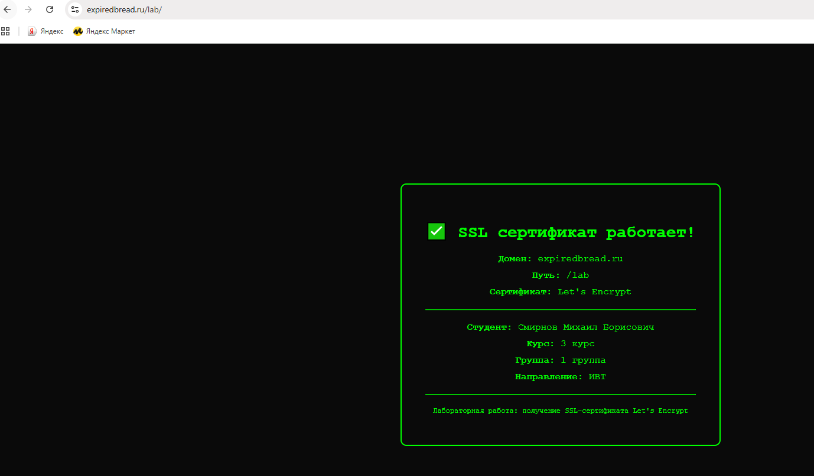
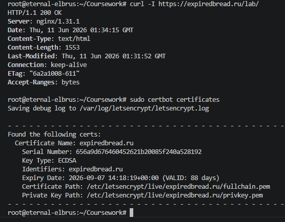

# Отчет по лабораторной работе
## Получение SSL-сертификата Let's Encrypt

**Студент:** Смирнов Михаил Борисович  
**Курс:** 3 | **Группа:** 1 | **Направление:** ИВТ  
**Домен:** expiredbread.ru/lab/    

---

### 1. Проверка работы HTTPS-соединения

*Рисунок 1. Визуальное подтверждение корректной работы SSL-сертификата и доступности ресурса по заданному пути.*

### 2. Диагностика сервера и сертификата

