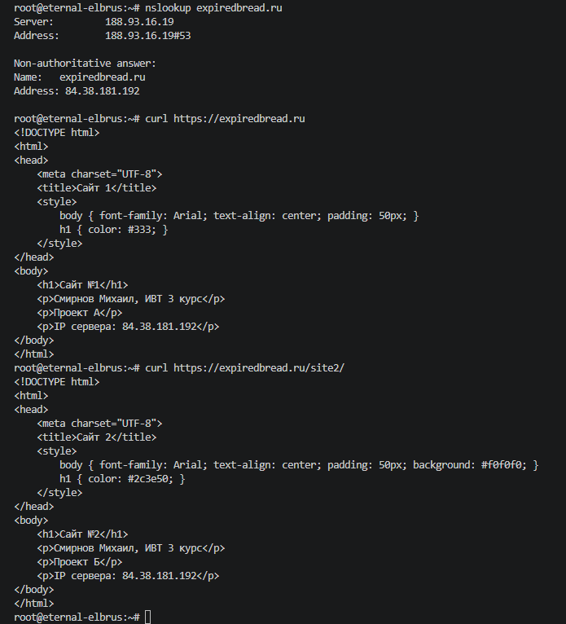
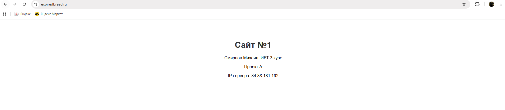
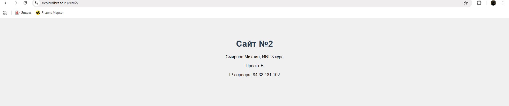

# Отчет по лабораторной работе
**Выполнил:** Смирнов Михаил, ИВТ 3 курс 1 группа 1 подгруппа

---

### 1. Развертывание сервера на хостинге
Сервер развернут, получен IP-адрес `84.38.181.192`

### 2. Установка NGINX
Веб-сервер NGINX установлен и настроен

### 3. Создание конфигураций
- `expiredbread.ru` — Проект А
- `expiredbread.ru-site2` — Проект Б

### 4. SSL-сертификаты и проверка
Выпущены сертификаты

---

## Результаты

### Проверка DNS и контента

### Сайт №1 (Проект А)

### Сайт №2 (Проект Б)

---
