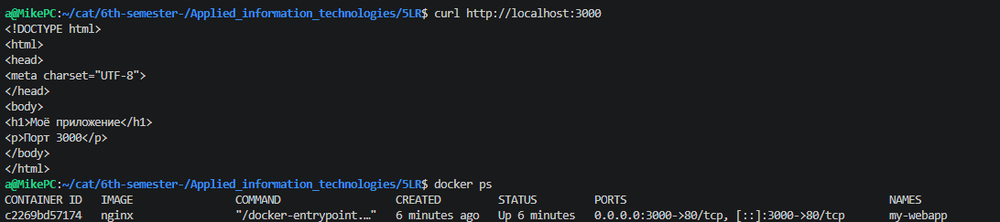

# Отчёт о запуске контейнера

## Начальное состояние
- Чистая установленная ОС в облаке (WSL)

## Выполненные действия

1. Установлен Docker
2. Запущен контейнер на основе образа **nginx**:
   ```bash
   docker run -d -p 3000:80 --name my-webapp nginx
   ```

3. Проверка работы контейнера:
   ```bash
   docker ps
   ```

## Результат

**Статус контейнера:**
- Container ID: `c2269bd57174`
- Image: `nginx`
- Status: Up (running)
- Ports: `0.0.0.0:3000->80/tcp`

**Проверка через терминал:**



**Демонстрация работы приложения в браузере:**


Приложение успешно доступно в браузере по адресу `http://localhost:3000` и отображает страницу с заголовком "Моё приложение ".
