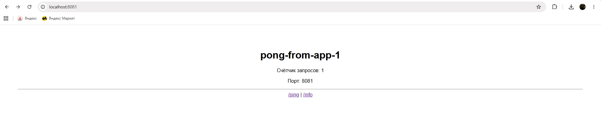
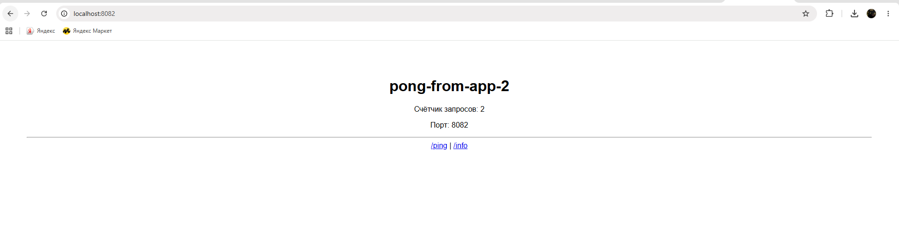
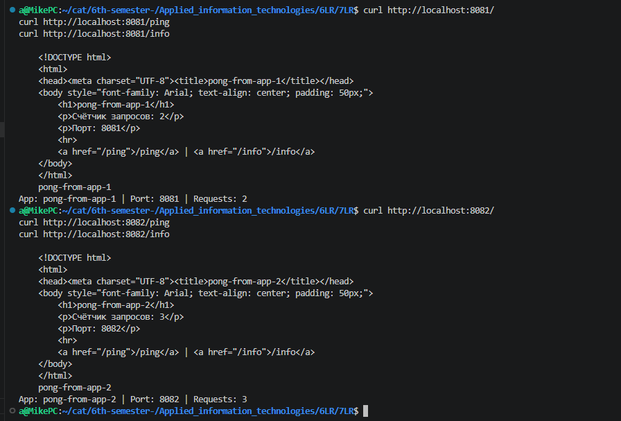

# Отчет: Веб-приложение Ping-Pong в Docker

**Выполнил:** Смирнов Михаил, ИВТ 3 курс 1

## Задание
Разработать веб-приложение (Ping-Pong) и запустить несколько экземпляров через docker-compose.

## Реализация

### Приложение
- **Язык:**  Python 
- **Эндпоинты:** `/`, `/ping`, `/info`

### docker-compose
Запущено 2 экземпляра приложения:
- **app-1** — порт 8081, ответ "pong-from-app-1"
- **app-2** — порт 8082, ответ "pong-from-app-2"

## Демонстрация работы

### Приложение 1 (порт 8081)

### Приложение 2 (порт 8082)

### Тестирование через CURL

