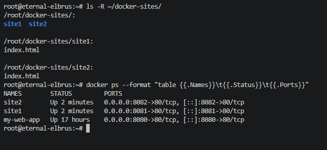
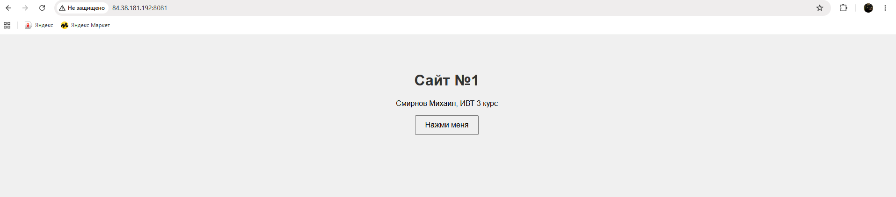
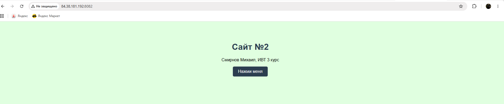

# Отчет: Запуск статичных сайтов в Docker NGINX

**Выполнил:** Смирнов Михаил, ИВТ 3 курс
### Структура каталогов и контейнеры


### Сайт №1 (порт 8081)


### Сайт №2 (порт 8082)


## Команды запуска

```bash
docker run -d --name site1 -p 8081:80 -v ~/docker-sites/site1:/usr/share/nginx/html nginx
docker run -d --name site2 -p 8082:80 -v ~/docker-sites/site2:/usr/share/nginx/html nginx