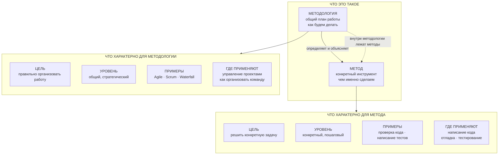

---

# Этап 2. Сопоставление и классификация

## Схема: как связаны «Метод» и «Методология»

---

## Примеры: как методы и методологии работают в жизни

Ниже 5 простых примеров из ИТ. В каждом показано, какая методология (общий план) и какие методы (конкретные действия) используются.

---

### Пример 1. Команда делает мобильное приложение

| Что это | Конкретно |
|---------|-----------|
| **Методология (план)** | Agile — работают короткими циклами (по 2 недели), каждый день обсуждают, что сделали |
| **Методы (инструменты)** | Ежедневные 5-минутные встречи, совместный просмотр кода, оценка задач по карточкам |
| **Суть** | Методология говорит *как построить работу*, а методы — *какие конкретные действия делать* |

---

### Пример 2. Автоматизация запуска сайта на сервере

| Что это | Конкретно |
|---------|-----------|
| **Методология (план)** | DevOps — разработчики и администраторы работают вместе, всё автоматизируют |
| **Методы (инструменты)** | Автоматическая проверка кода при каждом сохранении, автоматический выпуск новой версии |
| **Суть** | Методология требует автоматизации, а методы показывают *как именно автоматизировать* |

---

### Пример 3. Создание базы данных для магазина

| Что это | Конкретно |
|---------|-----------|
| **Методология (план)** | Проектирование «от данных» — сначала думаем, какие данные нужны, потом как их хранить |
| **Методы (инструменты)** | Рисуем схему «что с чем связано», убираем повторяющиеся данные, добавляем индексы для быстрого поиска |
| **Суть** | Методология задаёт направление (данные важны), а методы — конкретные шаги |

---

### Пример 4. Тестирование программы для банка

| Что это | Конкретно |
|---------|-----------|
| **Методология (план)** | Тестирование «от рисков» — сначала проверяем то, где ошибка будет самой опасной |
| **Методы (инструменты)** | Проверка граничных значений (что будет при 0 и 100), разбиение на похожие группы (нормальные, пограничные, ошибочные случаи) |
| **Суть** | Методология подсказывает *что проверять в первую очередь*, а методы — *как именно проверить* |

---

### Пример 5. Анализ, почему клиенты уходят из компании

| Что это | Конкретно |
|---------|-----------|
| **Методология (план)** | CRISP-DM — стандартный подход к анализу данных: сначала понять задачу, потом собрать и очистить данные, потом построить модель и проверить её |
| **Методы (инструменты)** | Изучение данных (графики, таблицы), построение предсказывающей модели (например, «дерево решений»), проверка качества модели на тестовых данных |
| **Суть** | Методология даёт пошаговый план работ с данными, а внутри каждого шага — свои методы |

---

