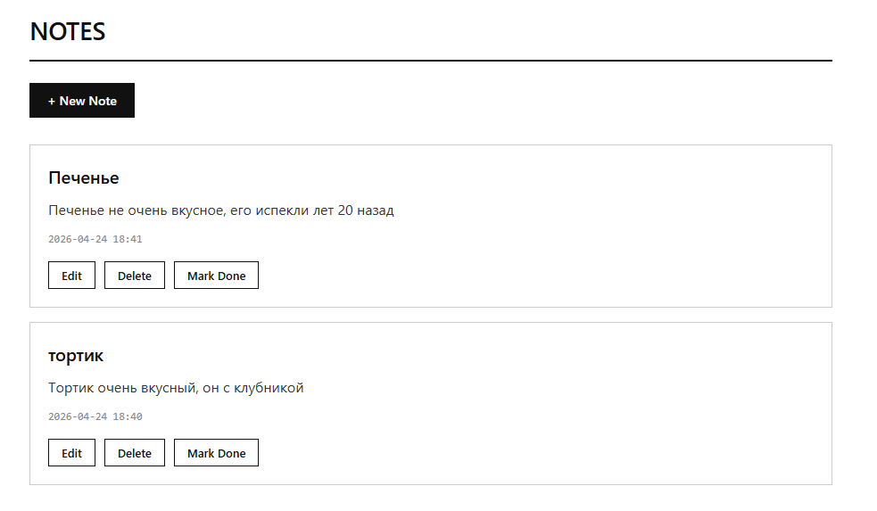
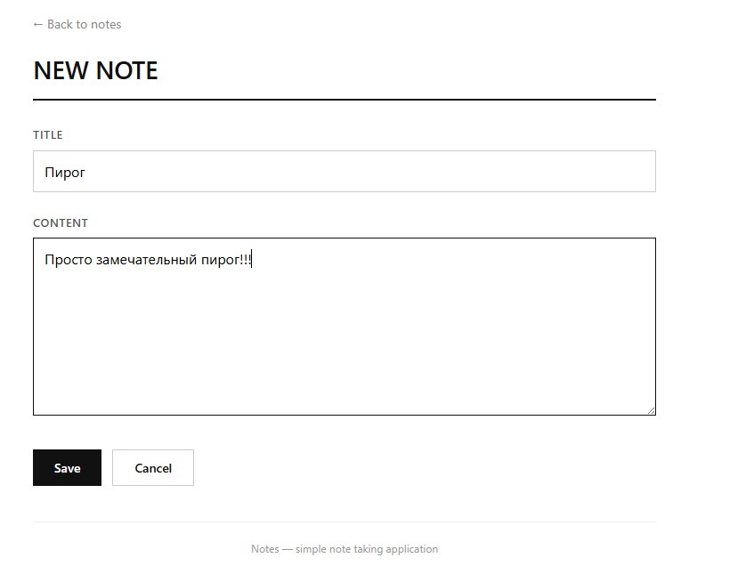

---

## README.md

```markdown
# Notes — веб-приложение для заметок

## Описание проекта

Простое веб-приложение для ведения личных заметок, разработанное на Django. Пользователь может создавать, редактировать, удалять заметки и отмечать их как выполненные.

---

## Выбранная методология

**Kanban**

Проект разработан с использованием методологии Kanban. Работа велась с визуализацией задач на доске:

| Столбец | Задачи |
|---------|--------|
| To Do | Анализ требований, проектирование БД |
| In Progress | Написание логики, создание шаблонов |
| Done | Настройка маршрутов, тестирование, запуск |

Kanban был выбран, так как проект небольшой, выполняется одним разработчиком, и не требует жёстких итераций (как Scrum). Это позволило гибко управлять задачами без перегрузки.

---

## Этапы работы и применённые методы

| № | Этап | Применённый метод | Описание |
|---|------|-------------------|----------|
| 1 | Анализ требований | Анализ пользовательских сценариев | Определены основные функции: просмотр, добавление, редактирование, удаление, отметка о выполнении |
| 2 | Создание проекта | Быстрый старт (Django CLI) | Создан каркас проекта с помощью `django-admin startproject` |
| 3 | Проектирование БД | Моделирование через код (Code-first) | Описана модель Note с полями title, text, created_date, is_done |
| 4 | Написание логики | CRUD (Create, Read, Update, Delete) | Реализованы функции для всех операций с данными |
| 5 | Создание шаблонов | MVC (разделение логики и представления) | HTML-шаблоны отделены от Python-кода |
| 6 | Настройка маршрутов | Явное связывание адресов | URL-адреса привязаны к функциям-обработчикам |
| 7 | Тестирование | Ручное функциональное тестирование | Проверены все сценарии использования |

---

## Скриншоты

### 1. Главный экран (список заметок)



*Рисунок 1 — Главная страница приложения со списком заметок*

---

### 2. Добавление новой заметки



*Рисунок 2 — Форма создания новой заметки*

---

## Установка и запуск

### Требования

- Python 3.12+
- pip

### Шаги для запуска

```bash
# 1. Клонировать или скачать проект
git clone https://github.com/KOTorCAT/6th-semester-/tree/main/Educational_and_research_workshop/1LR/3stage

# 2. Активировать виртуальное окружение
python3 -m venv venv
source venv/bin/activate

# 3. Установить зависимости
pip install -r requirements.txt

# 4. Выполнить миграции (создать базу данных)
python manage.py migrate

# 5. Запустить сервер
python manage.py runserver 8001
```

### Доступ к приложению

Откройте в браузере: **http://127.0.0.1:8001**

---

## Возможности приложения

| Функция | Описание |
|---------|----------|
| Просмотр заметок | Все заметки отображаются на главной странице, новые сверху |
| Создание заметки | Форма с полями "Заголовок" и "Текст" |
| Редактирование | Изменение существующей заметки |
| Удаление | Полное удаление заметки из базы данных |
| Отметка о выполнении | Переключение статуса is_done (зачёркивание текста) |

---

## Структура проекта

```
3stage/
├── manage.py
├── requirements.txt
├── db.sqlite3
├── screenshot_main.png          # скриншот главного экрана
├── screenshot_add.png           # скриншот добавления заметки
├── myproject/
│   ├── settings.py
│   └── urls.py
└── notes/
    ├── models.py
    ├── views.py
    ├── urls.py
    └── templates/
        └── notes/
            ├── index.html
            └── edit.html
```

---

## Используемые технологии

- **Django 6.0.4** — веб-фреймворк
- **SQLite** — встроенная база данных
- **HTML5 / CSS3** — интерфейс (чёрно-белая тема)

