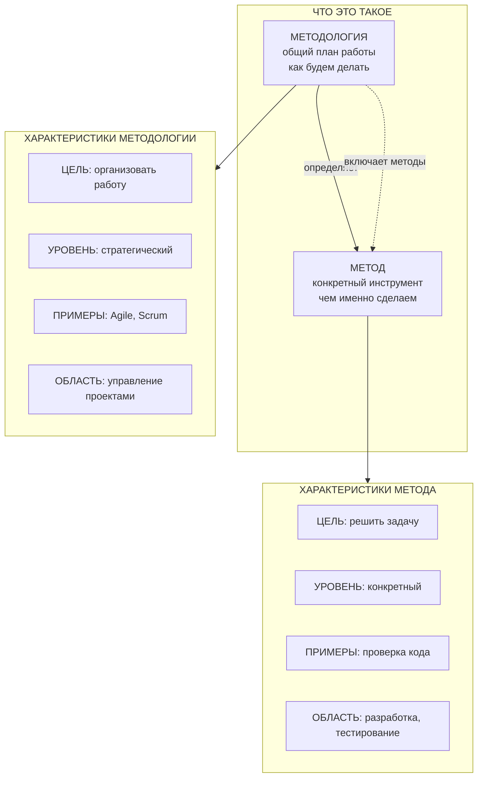

# Лабораторная работа №1

## Тема: Понятия «метод» и «методология» в науке и в решении ИТ-задач

---

**Студент:** Смирнов Михаил

**Группа:** ИВТ 3 курс, 1 группа


---

## 1. Цель и задачи работы

### Цель
Понять разницу между понятиями «метод» и «методология», научиться правильно выбирать методы при решении ИТ-задач.

### Задачи
1. Найти и проанализировать определения понятий «метод» и «методология» в разных источниках (не менее 7 трактовок)
2. Выявить сходства и различия в трактовках
3. Обосновать выбор методологии и методов для решения ИТ-задачи
4. Разработать мини-проект с использованием выбранных методологии и методов

---

## 2. Этап 1. Трактовки понятий «метод» и «методология»

### Таблица 1 – Трактовка понятий

| № | Источник | Трактовка понятия «метод» | Трактовка понятия «методология» | Особенности трактовки |
|---|----------|--------------------------|--------------------------------|----------------------|
| 1 | Большая советская энциклопедия | Способ построения и обоснования системы знаний | Учение о структуре и методах деятельности | Метод — инструмент познания |
| 2 | ГОСТ Р 57122-2016 | Последовательность действий для решения задачи | Совокупность методов в определённой области | Методология — набор методов |
| 3 | Новиков А.М., Новиков Д.А. | Набор приёмов для решения задачи | Учение об организации деятельности | Методология — организация работы |
| 4 | Канке В.А. | Форма освоения действительности | Анализ структуры науки и её методов | Философский подход |
| 5 | ISO/IEC/IEEE 24765:2017 | Процедура для выполнения действий | Набор методов и инструментов в области | Англоязычный стандарт |
| 6 | Леонтьев В.В. | Способ выполнения операции с результатом | Набор методов и правил для разработки ПО | Прикладной ИТ-подход |
| 7 | Сурмин Ю.П. | Последовательность шагов от данных к результату | Учение о принципах исследования систем | Системный подход |

[1stage.md](1stage.md)

### Вывод по этапу 1

**Метод** — это конкретный инструмент или способ действия для решения одной задачи. **Методология** — это общий план, который определяет, какие методы использовать и в каком порядке. Методология включает в себя набор методов. Простыми словами: метод отвечает на вопрос «как сделать действие?», методология — на вопрос «как организовать всю работу?».

---

## 3. Этап 2. Сопоставление и классификация

### 3.1. Схема связи понятий



 Подробная схема [2stage.md](2stage.md)

---

### 3.2. Примеры применения методов и методологий в ИТ

| № | Ситуация | Методология | Методы |
|---|----------|-------------|--------|
| 1 | Разработка мобильного приложения | Scrum | Ежедневные встречи, проверка кода |
| 2 | Автоматизация запуска сайта | DevOps | Автопроверка кода, автовыпуск версий |
| 3 | Создание базы данных магазина | Проектирование от данных | Схема связей, убирание повторов |
| 4 | Тестирование банковской системы | Тестирование от рисков | Проверка границ, разбиение на группы |
| 5 | Анализ оттока клиентов | CRISP-DM | Изучение данных, построение модели |

Описание примеров: [2stage.md](2stage.md)

---

## 4. Этап 3. Мини-проект

### 4.1. Постановка задачи

Разработать веб-приложение для ведения личных заметок. Функции: просмотр, добавление, редактирование, удаление, отметка о выполнении.

### 4.2. Выбранная методология

**Kanban** — работа с визуализацией задач на доске.

| Столбец | Задачи |
|---------|--------|
| To Do | Анализ, проектирование БД |
| In Progress | Логика, шаблоны |
| Done | Маршруты, тестирование, запуск |

**Почему:** проект небольшой, выполняется одним человеком, не нужны жёсткие итерации.

### 4.3. Этапы и методы

| № | Этап | Метод |
|---|------|-------|
| 1 | Анализ требований | Анализ сценариев |
| 2 | Создание проекта | Быстрый старт Django |
| 3 | Проектирование БД | Моделирование кодом |
| 4 | Написание логики | CRUD |
| 5 | Создание шаблонов | MVC |
| 6 | Настройка маршрутов | Привязка адресов |
| 7 | Тестирование | Ручное |

 Полный код проекта и документация: [3stage/](3stage/)

### 4.4. Скриншоты

| Скриншот | Описание |
|----------|----------|
|  | Список заметок |
|  | Форма создания заметки |

### 4.5. Запуск проекта

```bash
git clone https://github.com/KOTorCAT/6th-semester-/tree/main/Educational_and_research_workshop/1LR/3stage

# 2. Активировать виртуальное окружение
python3 -m venv venv
source venv/bin/activate

# 3. Установить зависимости
pip install -r requirements.txt

# 4. Выполнить миграции (создать базу данных)
python manage.py migrate

# 5. Запустить сервер
python manage.py runserver 8001
```

Открыть: **http://127.0.0.1:8001**

---

## 5. Список источников

1. **Большая российская энциклопедия. Метод** — URL: https://bigenc.ru/c/metod-85db71

2. **ГОСТ Р 57122-2016** — URL: http://irbis.fips.ru:8080/web/index.php?LNG=&Z21ID=&P21DBN=FIPS&I21DBN=FIPS_PRINT&S21FMT=fullw_print&C21COM=F&Z21MFN=9300

3. **Новиков А. М., Новиков Д. А.** Методология: словарь системы основных понятий — URL: http://library.volnc.ru/book/view?id=9442

4. **Едронова В. Н., Овчаров А. О.** Методы, методология и логика научных исследований // Экономический анализ: теория и практика. — 2013. — № 9 — URL: https://cyberleninka.ru/article/n/metody-metodologiya-i-logika-nauchnyh-issledovaniy

5. **Мухина Е. Р.** Методология менеджмента — URL: https://cyberleninka.ru/article/n/metodologiya-menedzhmenta

6. **Кознов Д. В.** Введение в программную инженерию — URL: https://intuit.ru/studies/courses/2260/252/lecture/15007

---

## 6. Вывод

В ходе выполнения лабораторной работы:

1. Проанализированы 7 трактовок понятий «метод» и «методология»
2. Составлена схема связи понятий и 5 примеров из ИТ
3. Разработано веб-приложение «Notes» на Django с методологией Kanban

Все файлы проекта доступны в папке: [1LR/](https://github.com/KOTorCAT/6th-semester-/tree/main/Educational_and_research_workshop/1LR)

---
