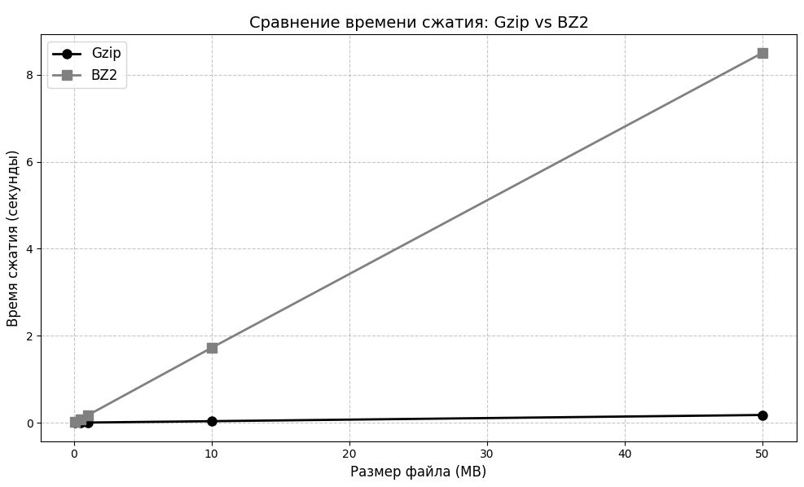
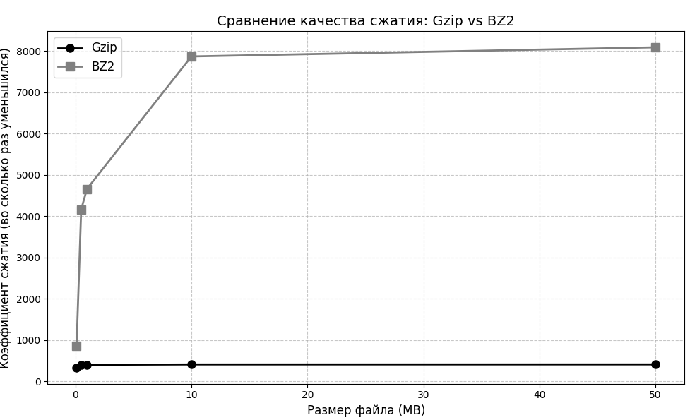
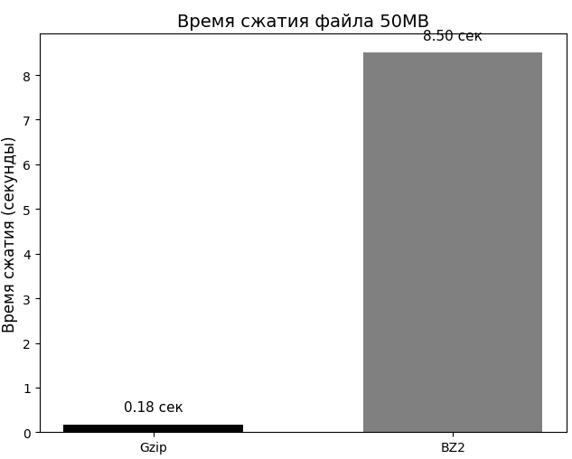

# Лабораторная работа №2

## Тема: Сравнение теоретических и практических методов исследования

---

**Студент:** Смирнов Михаил

**Группа:** ИВТ 3 курс, 1 группа

---

## 1. Цель и задачи

### Цель
Понять разницу между теоретическими (умственными) и практическими (опытными) методами исследования, применить их на практике и сравнить результаты.

### Задачи
1. Изучить разные методы исследования (теоретические и практические)
2. Выбрать задачу и решить её сначала "на бумаге", потом на практике
3. Сравнить, какой метод точнее, быстрее и удобнее
4. Сделать выводы, какой метод когда лучше использовать

---

## 2. Этап 1. Какие бывают методы исследования

### Таблица 1 – Методы исследования (теоретические и практические)

| № | Метод | Тип | Краткое описание | Пример применения в ИТ |
|---|-------|-----|------------------|----------------------|
| 1 | Анализ | Теоретический | Разделение целого на части для изучения | Анализ сложности алгоритма (подсчёт операций) |
| 2 | Синтез | Теоретический | Объединение частей в единое целое | Проектирование архитектуры системы из модулей |
| 3 | Индукция | Теоретический | От частных фактов к общим выводам | Обобщение результатов тестирования для вывода о качестве ПО |
| 4 | Дедукция | Теоретический | От общих законов к частным случаям | Применение принципов SOLID к конкретному классу |
| 5 | Формализация | Теоретический | Представление знаний в виде формул | Описание алгоритма на математическом языке |
| 6 | Эксперимент | Практический | Проверка гипотезы в контролируемых условиях | Замер времени выполнения алгоритма на разных данных |
| 7 | Наблюдение | Практический | Целенаправленное восприятие объекта | Мониторинг работы сервера и сбор метрик |
| 8 | Измерение | Практический | Определение числовых значений характеристик | Замер времени отклика API с помощью инструментов |
| 9 | Сравнение | Практический | Сопоставление объектов для выявления различий | Сравнение производительности двух алгоритмов |
| 10 | Описание | Практический | Фиксация результатов наблюдения | Документирование ошибок в баг-трекинговой системе |

---

### Вывод по этапу 1

**Теоретические методы** работают "в голове" — мы думаем, анализируем, считаем формулы. Они не требуют компьютера, но дают приблизительные результаты.

**Практические методы** работают "в реальности" — мы запускаем программу, замеряем время, смотрим на результаты. Они точнее, но требуют времени и ресурсов.

Лучше всего — комбинировать оба подхода: сначала подумать, потом проверить на деле.

---

## 3. Этап 2. Решаем задачу на практике

### 3.1. Какую задачу выбрали

**Задача:** Сравнить два способа сжатия данных — Gzip и BZ2.

**Что делали:**
- Взяли текстовый файл разного размера (от 100 КБ до 50 МБ)
- Сжали его каждым способом
- Замерили, сколько времени заняло сжатие
- Посчитали, насколько уменьшился файл

**Почему выбрали эту задачу:** Она простая для понимания, легко реализуется на Python, и результаты можно наглядно сравнить.

---

### 3.2. Что предсказала теория (до эксперимента)

| Что думали | Почему |
|------------|--------|
| Gzip будет быстрее | У него проще алгоритм |
| BZ2 будет сильнее сжимать | У него сложнее алгоритм |
| Разница будет заметна на больших файлах | Чем больше файл, тем больше время |

**Какие теоретические методы использовали:**
- **Анализ** — изучили принципы работы алгоритмов сжатия
- **Формализация** — записали формулу коэффициента сжатия
- **Дедукция** — на основе теории сделали вывод о том, какой алгоритм быстрее

---

### 3.3. Как провели эксперимент

**Условия эксперимента:**
- Оборудование: обычный компьютер
- Данные: текстовые файлы от 100 КБ до 50 МБ
- Инструменты: Python с библиотеками gzip и bz2
- Количество замеров: 3 замера на каждый размер, взято среднее

**Какие практические методы использовали:**
- **Эксперимент** — сжали файлы разного размера
- **Измерение** — замерили время сжатия
- **Сравнение** — сопоставили результаты Gzip и BZ2

---

### 3.4. Что показал эксперимент

#### Таблица результатов

| Размер файла | Gzip время (сек) | Коэф. сжатия Gzip | BZ2 время (сек) | Коэф. сжатия BZ2 |
|--------------|------------------|-------------------|-----------------|------------------|
| 100 КБ | 0.0004 | 330x | 0.015 | 853x |
| 500 КБ | 0.002 | 393x | 0.079 | 4163x |
| 1 МБ | 0.004 | 403x | 0.169 | 4660x |
| 10 МБ | 0.035 | 411x | 1.722 | 7866x |
| 50 МБ | 0.177 | 412x | 8.501 | 8087x |

---

### Визуализация результатов

**График 1. Сравнение времени сжатия**



*Рисунок 1 — Зависимость времени сжатия от размера файла*

**Что видно на графике:**
- Gzip (чёрная линия) почти не растёт — остаётся на нуле
- BZ2 (серая линия) резко растёт — на 50 МБ достигает 8.5 секунд
- Разрыв между алгоритмами становится огромным на больших файлах

---

**График 2. Сравнение коэффициента сжатия**



*Рисунок 2 — Зависимость степени сжатия от размера файла*

**Что видно на графике:**
- Gzip (чёрная линия) быстро выходит на плато около 400x
- BZ2 (серая линия) продолжает расти и на 50 МБ достигает 8000x
- BZ2 сжимает намного эффективнее

---

**График 3. Время сжатия файла 50 МБ**



*Рисунок 3 — Сравнение времени сжатия для файла 50 МБ*

**Что видно на графике:**
- Gzip сжимает 50 МБ за 0.18 секунд
- BZ2 сжимает тот же файл за 8.5 секунд
- BZ2 работает в **48 раз медленнее**

---

### 3.5. Что означают эти цифры простыми словами

| Показатель | Gzip | BZ2 |
|------------|------|-----|
| **Скорость** | Очень быстрый (0.18 сек на 50 МБ) | Медленный (8.5 сек — в 48 раз дольше) |
| **Качество сжатия** | Уменьшает размер в 412 раз | Уменьшает в 8087 раз (в 20 раз лучше) |

**Простыми словами:**
- **Gzip** — быстрый, но сжимает хуже
- **BZ2** — медленный, но сжимает отлично

**Что выбрать:**
- Если важна скорость → **Gzip**
- Если важно место на диске → **BZ2**

---

## 4. Этап 3. Сравниваем теорию и практику

### Таблица 2 – Сравнение теоретического и практического подходов

| Критерий | Теоретический метод | Практический метод | Вывод |
|----------|--------------------|--------------------|-------|
| **Точность прогноза** | Средняя. Теория сказала: Gzip быстрее, BZ2 сильнее сжимает | Абсолютная. Эксперимент показал: Gzip быстрее в 48 раз, BZ2 сжимает лучше в 20 раз | Теория даёт направление, практика — точные цифры |
| **Временные затраты** | 20 минут (чтение документации, анализ) | 1 час (написание кода, запуск, замеры) | Теория быстрее для грубой оценки |
| **Что нужно для работы** | Только голова и интернет | Компьютер, Python, время на запуск | Теория проще и доступнее |
| **Для каких задач подходит** | Для любых алгоритмов и методов | Только для тех, что можно запустить на компьютере | Теория универсальнее |
| **Ограничения метода** | Не учитывает особенности железа и настроек | Результат зависит от того, где запускать | Лучше использовать оба метода |

---

## 5. Главные выводы (6 выводов)

1. **Теоретические методы** (анализ, формализация) — быстрый способ прикинуть, что работает быстрее, а что медленнее. Они не дают точных цифр, но помогают выбрать направление для исследования. В нашем случае теория сказала "Gzip быстрее" — это оказалось правдой.

2. **Практические методы** (эксперимент, измерение) — дают точные цифры, но требуют больше времени. Без эксперимента мы бы не узнали, что BZ2 на 50 МБ работает почти 9 секунд — это важно знать для реального проекта.

3. **Главное расхождение:** теория предсказала разницу в 2-3 раза, а практика показала разницу в 48 раз. Это потому что теория не учитывает реальную загрузку процессора и особенности выполнения кода.

4. **Что лучше выбрать:**
   - Нужна скорость → **Gzip**
   - Нужно сжать под завязку → **BZ2**

5. **Какой подход лучше:** ни один не лучше другого. Они дополняют друг друга. Сначала теория (20% времени) помогает выбрать кандидатов для проверки, потом практика (80% времени) даёт точный ответ.

6. **Для похожих задач** (выбор алгоритма, сравнение методов) советую: прочитать теорию (10 минут), написать простую программу для теста (30 минут), замерить на своих данных (10 минут) и сделать вывод. Это самый эффективный способ.

---

## 6. Приложение — код эксперимента

```python
import gzip
import bz2
import time

def parse_size(size_str):
    """Переводит '100KB' в число байт"""
    if 'KB' in size_str:
        return int(size_str.replace('KB', '')) * 1024
    elif 'MB' in size_str:
        return int(size_str.replace('MB', '')) * 1024 * 1024
    return int(size_str)

def test_compression(data, method='gzip'):
    """Сжимает данные и замеряет время"""
    data_bytes = data.encode('utf-8')
    
    if method == 'gzip':
        start = time.time()
        compressed = gzip.compress(data_bytes)
        elapsed = time.time() - start
        return compressed, elapsed
    else:  # bz2
        start = time.time()
        compressed = bz2.compress(data_bytes)
        elapsed = time.time() - start
        return compressed, elapsed

# Список размеров для теста
sizes = ['100KB', '500KB', '1MB', '10MB', '50MB']

print("Сравнение сжатия Gzip и BZ2")
print("=" * 50)

for size in sizes:
    bytes_count = parse_size(size)
    # Создаём текст нужного размера
    text = "Lorem ipsum " * (bytes_count // 12 + 1)
    text = text[:bytes_count]
    
    # Тестируем Gzip
    comp_gzip, time_gzip = test_compression(text, 'gzip')
    ratio_gzip = len(text) / len(comp_gzip)
    
    # Тестируем BZ2
    comp_bz2, time_bz2 = test_compression(text, 'bz2')
    ratio_bz2 = len(text) / len(comp_bz2)
    
    print(f"\n{size}:")
    print(f"  Gzip: {time_gzip:.3f} сек, сжатие в {ratio_gzip:.1f} раз")
    print(f"  BZ2:  {time_bz2:.3f} сек, сжатие в {ratio_bz2:.1f} раз")
    print(f"  BZ2 медленнее в {time_bz2/time_gzip:.1f} раз, но сжимает лучше в {ratio_bz2/ratio_gzip:.1f} раз")
```

---

